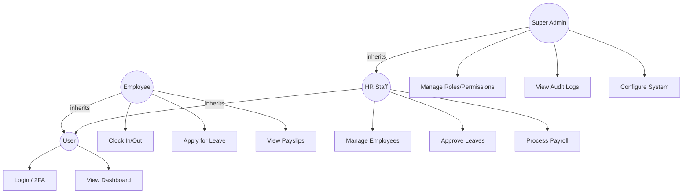
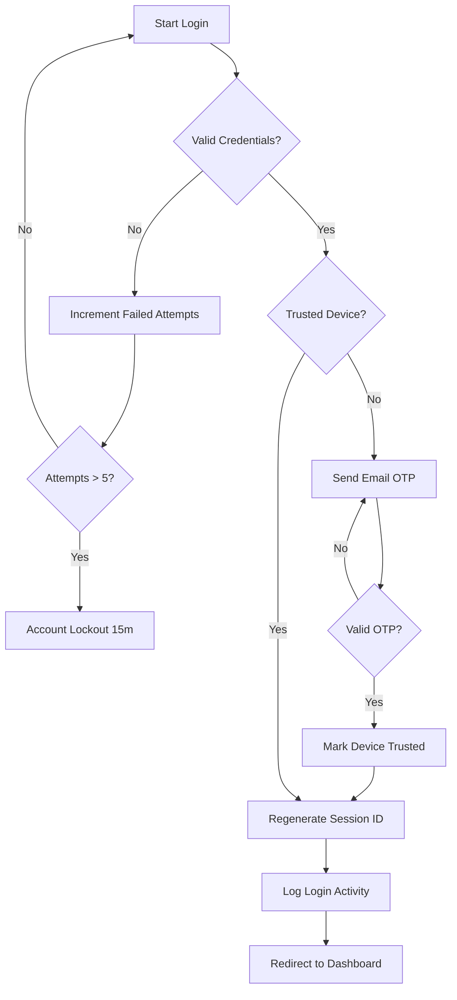

# I. PROJECT PROFILE

The Human Resource Management System (NexaHR) is a production-ready, web-based platform designed to streamline the entire employee lifecycle, from recruitment to offboarding. This system integrates core HR functions—including employee record management, attendance tracking, payroll processing, leave management, and performance evaluation—into a centralized digital ecosystem. Built with a "security-first" architecture, NexaHR addresses modern data privacy challenges such as unauthorized access, data breaches, and session hijacking. The system features multi-layered security protocols including Two-Factor Authentication (2FA), Role-Based Access Control (RBAC), and AES-256-CBC encryption for sensitive personal information. NexaHR is designed to enhance organizational efficiency, ensure data integrity, and provide a transparent, self-service experience for employees while giving HR administrators robust tools for workforce analytics and security monitoring.

## 1. Project Title
**NexaHR: Secure Human Resource Management System** is a comprehensive digital solution designed to manage large-scale employee data, secure sensitive information, and automate organizational workflows. The system focuses on maintaining high performance and consistency in tracking attendance, processing payroll, and managing personnel records. It is implemented to assist HR departments in organizing and securing data inputs to prevent misinformation, data loss, and unauthorized data breaches.

## 2. Integrated System
The NexaHR is a centralized digital platform that integrates various HR processes into a single, cohesive interface. By consolidating these functions, the system enhances efficiency and provides real-time access to critical HR information.

The NexaHR consists of multiple interconnected modules:
*   **Overview & Dashboard**: Real-time analytics and HR metrics.
*   **Employee Management**: Complete lifecycle tracking and PII-encrypted records.
*   **Attendance Tracking**: Real-time clock-in/out with status monitoring.
*   **Payroll Management**: Automated calculations and secure payslip generation.
*   **Leave Management**: Digital application and multi-level approval workflow.
*   **Recruitment & Talent Acquisition**: Job postings and applicant tracking.
*   **Performance & Training**: Evaluations and professional development tracking.
*   **Security & Audit**: 2FA, session management, and comprehensive audit logs.
*   **System Administration**: Role management, settings, and system monitoring.

Employees can utilize the self-service portal to access personal records, apply for leaves, and view payslips, fostering transparency and reducing administrative overhead. HR administrators and Super Admins manage the entire process, utilizing advanced tools to monitor system activity, handle security incidents, and ensure data protection compliance.

## 3. Sub-System
Here’s the list of our sub-systems with their purposes:

### Dashboard & Overview
*   **Main Dashboard**
    - Provides a real-time summary of HR metrics, including employee counts, attendance statistics, and pending leave requests. It helps administrators monitor the pulse of the organization at a glance.
*   **Notifications**
    - Sends real-time alerts for system logins from new devices, leave approvals, and important company updates.

### Employee Management
*   **Employee Directory**
    - A searchable list of all active and inactive employees, showing their departments, roles, and contact information.
*   **Employee Profile (Self-Service)**
    - Allows employees to view and update their personal details, track their own documents, and manage their security settings.
*   **Document Vault**
    - A secure storage area for employee-specific documents (e.g., contracts, IDs) with encryption at rest.

### Attendance & Leave
*   **Attendance Tracking**
    - Features a real-time clock-in/clock-out system with automatic status categorization (Present, Late, Absent, Half Day).
*   **Leave Request System**
    - An online portal for submitting leave applications with tracking for approval status and leave balances.

### Payroll & Compensation
*   **Payroll Processing**
    - Automates the calculation of salaries based on attendance, earnings, and deductions.
*   **Payslip Management**
    - Generates and stores secure payslips for employees to download in PDF format.

### Recruitment & Talent
*   **Job Board**
    - Displays internal and external job openings.
*   **Applicant Tracking**
    - Manages the status of candidates from application to hiring (Reviewing, Interview, Offered, Hired).

### Security & Administration
*   **Security Center**
    - Manages 2FA settings, session monitoring, and trusted device lists.
*   **Audit Trail**
    - Records every significant action taken within the system, providing full accountability for data modifications.
*   **User & Role Management**
    - Defines granular permissions for different roles (HR Director, Finance Manager, etc.) to ensure the principle of least privilege.

# II. EXECUTIVE SUMMARY

## Project Overview
**NexaHR: Secure Human Resource Management System**

## Background of the Problem
In many organizations, managing an increasing number of employee records through manual or fragmented digital files (like spreadsheets) leads to significant operational challenges. Common problems include:
*   **Data Inconsistency**: Scattered records lead to duplicates and outdated information.
*   **Operational Delays**: Manual processing of leaves and payroll is time-consuming and prone to human error.
*   **Security Risks**: Handling sensitive Personal Identifiable Information (PII) without encryption or strict access control exposes the organization to data breaches and identity theft.
*   **Lack of Accountability**: Without comprehensive audit logs, tracking who modified sensitive records becomes impossible.
*   **Communication Gaps**: Manual announcements and updates often fail to reach all employees in a timely manner.

## Description of the Proposed System
NexaHR is a secure, integrated platform designed to centralize and automate HR operations while enforcing enterprise-grade security. The system utilizes a multi-role architecture:
*   **Super Admin**: Full system control and security monitoring.
*   **HR Director/Specialist**: Manages employee records, reviews applications, and oversees HR workflows.
*   **Finance Manager**: Handles payroll processing and financial record management.
*   **Department Manager**: Reviews attendance and leave requests for their team.
*   **Employee**: Accesses personal records, attendance logs, and self-service requests.
*   **Applicant**: Tracks job applications and submits required recruitment documents.

The system is built on a modern PHP/MySQL stack with security features as a core component. It includes PII encryption (AES-256), Two-Factor Authentication (2FA), and a unique session management system that limits active sessions to two per user, preventing account compromise.

## Key Objectives
1.  **Centralization**: Consolidate all HR data into a single, secure database.
2.  **Automation**: Reduce administrative workload by automating payroll and attendance tracking.
3.  **Security**: Protect sensitive data using industry-standard encryption and 2FA.
4.  **Accountability**: Implement a robust audit trail for every data modification.
5.  **Transparency**: Empower employees through a self-service portal for personal HR needs.
6.  **Efficiency**: Improve the speed of recruitment and approval processes.
7.  **Accuracy**: Minimize human errors in salary calculations and attendance records.
8.  **Monitoring**: Real-time tracking of system access, login locations, and security threats.
9.  **Compliance**: Ensure the system follows data privacy regulations regarding PII.
10. **Scalability**: Design a platform that can grow with the organization's needs.

## Security Features Applied
*   **AES-256-CBC Encryption**: Encrypts PII data at rest.
*   **2FA (Two-Factor Authentication)**: Mandatory OTP verification via email.
*   **Dual-Device Session Limit**: Prevents unauthorized multi-device access.
*   **Role-Based Access Control (RBAC)**: Granular permission management.
*   **Audit Logging**: Detailed tracking of all user actions and system changes.
*   **CSRF/XSS Protection**: Defense against common web vulnerabilities.
*   **Trusted Device Management**: Secure long-term access for verified devices.
*   **Rate Limiting & Account Lockout**: Protection against brute-force attacks.

## Expected Results and Benefits
Upon full implementation, NexaHR will deliver a 40% reduction in manual HR administrative time and near-zero errors in payroll processing. The organization will achieve a significantly higher security posture, reducing the risk of data breaches by encrypting sensitive information and enforcing strict access controls. Employees will benefit from instant access to payslips and real-time updates on their requests, leading to increased job satisfaction and organizational transparency.

# III. INTRODUCTION

Managing personnel in a modern institution requires more than just a digital spreadsheet. As organizations grow, the complexity of tracking attendance, processing diverse leave requests, calculating accurate payroll, and maintaining secure employee records increases exponentially. NexaHR is designed to meet these challenges by providing a secure, automated, and centralized platform for Human Resource Management.

## 1. Background of the Study
The digital transformation of HR processes is no longer optional; it is a necessity for security and efficiency. Many organizations still rely on traditional methods like paper forms or unencrypted spreadsheets, which are inherently insecure and inefficient. These methods lack real-time synchronization, making it difficult for management to get an accurate view of the workforce. Furthermore, the rising threat of cyberattacks targeting sensitive personal data makes the security of HR systems a top priority. NexaHR addresses these needs by integrating modern web technologies with enterprise-grade security frameworks.

## 2. Statement of the Problem
Existing manual or semi-digital HR processes face the following critical issues:
*   **Inefficient Data Entry**: High risk of errors in attendance and payslip records.
*   **Security Vulnerabilities**: Sensitive data is often stored in plain text or shared over insecure channels.
*   **Zero Accountability**: Lack of logs makes it impossible to trace unauthorized data changes.
*   **Manual Overhead**: HR staff spend too much time on repetitive tasks like calculating hours worked.
*   **Fragmented Systems**: Using multiple tools for recruitment, payroll, and attendance creates data silos.

## 3. Project Objectives
### General Objective
To develop and implement a Secure Integrated Human Resource Management System (NexaHR) that centralizes HR operations, automates administrative tasks, and enforces high-level data security and privacy.

### Specific Objectives
*   Develop a centralized database with PII encryption for secure storage.
*   Automate attendance tracking and payroll calculations.
*   Implement a 2FA system and session management for account security.
*   Create an Employee Self-Service (ESS) portal for transparency.
*   Integrate recruitment and performance modules into the HR workflow.
*   Establish a comprehensive audit trail for historical record tracking.

## 4. Significance of the Study
*   **Employees**: Benefit from faster request approvals and secure access to personal data.
*   **HR Staff**: Can focus on strategic initiatives instead of manual data entry and calculation.
*   **Organization**: Gains a secure, reliable, and compliant platform for workforce management.
*   **Management**: Receives accurate, real-time analytics for better decision-making.

## 5. Scope & Limitation
### Scope
The system covers the entire employee lifecycle: recruitment, onboarding, records management, attendance, payroll, leaves, performance, and offboarding. It includes advanced security features like 2FA, session tracking, and PII encryption.

### Limitation
*   **Connectivity**: Requires internet/intranet access to function.
*   **Government Integration**: Does not automatically file taxes or government contributions (SSS/PhilHealth) but generates reports for them.
*   **Biometric Hardware**: Relies on software-based clock-in (can be integrated with hardware in future versions).

# IV. FRAMEWORK

## 1. Existing Business Process
The existing business process for Human Resource Management in the organization primarily relies on manual, paper-based workflows or unintegrated digital files (like spreadsheets). Employee records, attendance, and leave requests are handled through separate systems or physical documents. For instance, an employee submits a printed leave form, which is manually reviewed and approved by HR, then filed. Attendance is tracked through disparate logs that require manual consolidation for payroll processing. Announcements are made via informal channels like group chats or physical bulletin boards. This lack of centralization creates data silos and leads to significant delays in HR transactions.

### Manual Steps in the Process:
*   Employees fill out physical or digital (unlinked) leave forms.
*   HR staff manually track leave balances and approve requests.
*   Attendance logs are manually encoded into a spreadsheet for payroll.
*   Employee files are updated by manually editing multiple disconnected records.
*   Documents like contracts and IDs are physically stored in filing cabinets.
*   Announcements are shared through fragmented communication channels.

### Security Weaknesses:
*   **Limited Access Control**: Physical files and spreadsheets lack granular permission settings.
*   **Lack of Audit Trails**: No record of who viewed or modified sensitive data.
*   **Data Loss Risk**: High vulnerability to physical damage, misplacement, or accidental deletion.
*   **Exposed PII**: Sensitive data is often stored in plain text, accessible to anyone with file access.
*   **Inefficient Monitoring**: No mechanism to track suspicious access or unauthorized logins.

# V. SYSTEM ANALYSIS

## 1. Existing System
The current "system" is a mixture of manual processes and basic digital tools (Excel, Word) that are not interconnected. This fragmentation forces HR personnel to manually compile reports and monitor activity, which is slow and prone to human error. Decisions are based on delayed information, and the lack of a centralized database prevents real-time updates across departments.

### Limitations and Risks:
*   **Manual Processing**: High administrative overhead and risk of calculation errors.
*   **Lack of Centralization**: Scattered data leads to inconsistencies and difficulty in reporting.
*   **Limited Security**: No encryption, weak password policies, and zero multi-factor authentication.
*   **Poor Accountability**: Inability to identify responsible parties for data changes.
*   **Inefficient Communication**: Delays in sharing critical organizational updates.
*   **Data Privacy Gaps**: Non-compliance with modern data protection standards for PII.

## 2. Threats and Risk Assessment
### Possible Threats:
*   **Unauthorized Access**: External hackers or malicious insiders attempting to view or steal PII.
*   **Data Corruption/Loss**: Accidental deletion or hardware failure without automated backups.
*   **Session Hijacking**: Attackers stealing active session tokens to bypass authentication.
*   **Brute-Force Attacks**: Automated attempts to guess weak user passwords.
*   **Identity Theft**: Misuse of stolen employee personal and financial information.

### Vulnerabilities:
*   **Lack of Encryption**: Storing sensitive data in plain text.
*   **Weak Authentication**: Single-factor login without device verification or OTP.
*   **No Simultaneous Device Limit**: Allowing infinite logins from multiple devices concurrently.
*   **Output Exposure**: Vulnerability to XSS or CSRF without modern security tokens.
*   **Fragmented Backups**: No centralized, scheduled data backup strategy.

### Impact and Likelihood:
*   **Unauthorized Access**: High Impact (Data breach), Moderate Likelihood.
*   **Data Loss**: High Impact (Operational stop), Moderate Likelihood.
*   **Session Hijacking**: Moderate Impact (Temporary access), Moderate Likelihood.
*   **Brute-Force**: Moderate Impact (Account lockout), High Likelihood.

## 3. Security Requirement Analysis
*   **Authentication**: The system must require unique credentials, 2FA, and trusted device verification.
*   **Authorization**: Strict Role-Based Access Control (RBAC) to enforce the "least privilege" principle.
*   **Encryption**: AES-256-CBC encryption for all PII data at rest and HTTPS for data in transit.
*   **Logging**: Comprehensive audit trail for all create, update, and delete actions.
*   **Session Security**: Simultaneous device limits, automatic timeouts, and cross-tab logout sync.

## 4. Proposed Secure Integrated System
The NexaHR is designed to replace these flawed manual processes with a single, secure, and automated ecosystem. By centralizing all data into a PostgreSQL/MySQL database with PII encryption, the system ensures that every HR transaction is recorded, secured, and auditable. Automation of payroll and attendance reduces human error, while integrated communication tools ensure that all employees stay informed. Most importantly, the system's "defense-in-depth" security model—including 2FA, session limits, and RBAC—ensures that organizational data remains protected against modern cyber threats.

# VI. SYSTEM DESIGN

## 1. Existing System Analysis
The current fragmented workflow relies on the integrity of individual actors rather than a systemic security framework. This makes it impossible to scale accurately or maintain high standards of data privacy. The absence of a real-time monitoring system means that security incidents (like unauthorized logins) go undetected for weeks or months.

## 2. Threats and Risk Assessment (System Level)
*   **Database Infiltration**: Risk of SQL injection or direct DB access. *Mitigated by: Prepared statements and network-level security.*
*   **Password Compromise**: Users using breached passwords. *Mitigated by: Have I Been Pwned API integration and strict password policies.*
*   **Privilege Escalation**: Users gaining access to admin features. *Mitigated by: Role-based permission checks at the controller level.*

## 3. Security Requirements Analysis (Implementation)
### Authentication:
*   **Bcrypt Hashing**: All passwords are hashed using salt-included bcrypt.
*   **2FA (Email OTP)**: Mandatory for all roles except where specifically waived.
*   **Account Lockout**: 5 failed attempts trigger a 15-minute temporary ban.

### Authorization:
*   **RBAC Middleware**: Every request is checked against the user's role and assigned module permissions (View, Create, Edit, Delete).

### Encryption:
*   **AES-256-CBC**: Used for employee SSN, bank details, and other sensitive contact info.

### Logging:
*   **Audit Logger Class**: Captures User ID, Timestamp, IP Address, User Agent, Module, and Action Description.

## 4. Proposed Secure Integration System
The system architecture follows the Model-View-Controller (MVC) pattern, ensuring a clean separation of concerns. Security is not an "add-on" but is integrated into the core helper functions (e.g., `requireLogin`, `requirePermission`, `encryptData`). This design ensures that as the system expands, new modules inherit the same high security standards automatically.

# VII. SYSTEM MODULES AND FUNCTIONAL FEATURES

## 1. Dashboard
**Purpose**: Provides a real-time overview of organizational analytics and system health.
**Key Features**:
*   Real-time counters for Total Employees, Present Today, and Pending Leaves.
*   Recent Activity feed showing latest system events.
*   Quick-link buttons to common HR actions.
*   Visual charts for attendance trends.
**Security Considerations**:
*   Role-based data filtering (Employees see their own stats; Admins see organizational stats).
*   No sensitive PII displayed in summary cards.
*   CSRF protection on all dashboard widgets.

## 2. Employee Management
**Purpose**: Manages the complete lifecycle of employees from onboarding to retirement.
**Key Features**:
*   Comprehensive profile management (Personal, Professional, Financial).
*   PII Data Encryption for sensitive fields (Social Security, Bank Accounts).
*   Avatar/Profile photo upload and processing.
*   Employment status tracking (Active, Inactive, Probation).
**Security Considerations**:
*   AES-256-CBC encryption for sensitive personal identification numbers.
*   Strict RBAC for editing employee records.
*   Audit logging for every change in employee status or data.

## 3. Attendance Tracking
**Purpose**: Monitors employee work hours and punctuality in real-time.
**Key Features**:
*   Digital Clock-in/Clock-out system with IP and location logging.
*   Automatic status tagging (Present, Late, Absent, Half Day).
*   Monthly and weekly attendance grid views.
*   Exportable attendance reports for payroll integration.
**Security Considerations**:
*   Proxy-aware IP detection to prevent "buddy punching" from unauthorized locations.
*   Locking of attendance records once a payroll period is closed.
*   Validation of timestamps to prevent manual browser-side manipulation.

## 4. Payroll Management
**Purpose**: Automates salary computations and manages financial disbursements.
**Key Features**:
*   Automated calculation of gross pay, deductions, and net pay.
*   Payroll period management (Monthly/Semi-monthly).
*   Secure PDF payslip generation with currency formatting.
*   Historical payroll record archives.
**Security Considerations**:
*   Finance Manager role-only access to payroll processing.
*   Encrypted storage of bank account details.
*   Multi-level sign-off required for finalizing payroll runs.

## 5. Leave Management
**Purpose**: Streamlines the process of applying for and approving time off.
**Key Features**:
*   Online leave application with attachment support (e.g., Medical Certificates).
*   Real-time leave balance tracking (Sick Leave, Vacation Leave).
*   Multi-level approval workflow (Pending → Approved/Rejected).
*   Calendar view of approved leaves to prevent department under-staffing.
**Security Considerations**:
*   Approval actions restricted to authorized managers and HR staff.
*   Secure storage of medical documents in the Document Vault.
*   Audit logging of all approval/rejection comments.

## 6. Recruitment & Talent Acquisition
**Purpose**: Manages the ends-to-end hiring process and pipeline.
**Key Features**:
*   Job vacancy posting and internal/external board management.
*   Applicant profile creation and resume parsing.
*   Candidate status tracking (Reviewing, Interview, Offer, Hired).
*   Automated email notifications to candidates.
**Security Considerations**:
*   Protection of applicant contact data.
*   XSS sanitization for all resume/application text fields.
*   Restricted access for external applicants to the main system modules.

## 7. Performance & Training
**Purpose**: Supports employee growth and evaluates organizational productivity.
**Key Features**:
*   Structured performance appraisal forms and ratings (1-5 scale).
*   Training program enrollment and progress tracking.
*   Skill gap analysis and developmental feedback.
*   Historical performance review archives.
**Security Considerations**:
*   Confidentiality of performance scores (visible only to Self, Manager, and HR).
*   Secure storage of training certifications.
*   Tamper-proof rating system with fixed audit logs.

## 8. Security Center & Audit Logs
**Purpose**: Monitors system integrity and manages advanced security protocols.
**Key Features**:
*   Two-Factor Authentication (2FA) management.
*   Real-time Session Monitoring and remote revocation.
*   Trusted Device list management.
*   Global Audit Trail showing "Who, What, When, and Where" for every action.
**Security Considerations**:
*   Super Admin-only access to global logs.
*   Read-only enforcement for audit logs to prevent tampering.
*   Real-time alerts for login attempts from unrecognized IP addresses.

## 9. System Administration
**Purpose**: Manages global system settings, roles, and permissions.
**Key Features**:
*   Granular RBAC permission matrix (Module-wise View/Create/Edit/Delete).
*   Global system configuration (App Name, Currency, Timezone).
*   Automated backup monitoring and system logs.
*   Role assignment and user account deactivation.
**Security Considerations**:
*   Multi-factor authentication mandatory for any changes to roles or permissions.
*   Logging of all global settings modifications.
*   Secure storage of encryption keys and API secrets.

# VIII. DEVELOPMENT METHODOLOGY

The development of NexaHR follows an **Agile Development Methodology** integrated with a **Secure Software Development Life Cycle (Secure SDLC)**. This approach ensures that security is not treated as an afterthought but is built into every phase of the project—from requirement gathering to deployment and maintenance.

## 1. Agile Methodology
The project is divided into iterative sprints, allowing for continuous feedback and incremental feature releases. Each sprint includes planning, design, development, and testing of specific modules (e.g., Attendance, Payroll), ensuring that the system is always functional and secure.

## 2. Security Activities per Phase
*   **Planning**: Identification of data privacy Requirements (PII) and threat modeling.
*   **Design**: Secure architecture planning, including the MVC pattern and encryption layer.
*   **Development**: Implementation of secure coding practices (Input sanitization, output escaping, prepared statements).
*   **Testing**: Vulnerability scanning, penetration testing of the 2FA system, and code review.
*   **Deployment**: Secure server configuration and encryption key management.
*   **Maintenance**: Continuous monitoring of audit logs and security updates.

## 3. Tools and Technologies
*   **Backend**: PHP 8.x (Core logic and API).
*   **Database**: MySQL / MariaDB (Relational data storage).
*   **Mailing**: PHPMailer with SMTP integration (For 2FA OTP and notifications).
*   **Security APIs**: 
    - **Have I Been Pwned API**: For breached password checks.
    - **ip-api.com**: For IP geolocation and login tracking.
*   **Frontend**: Vanilla CSS, JavaScript, and Bootstrap 5 (Responsive UI).
*   **Encryption**: OpenSSL (AES-256-CBC) for PII protection.
*   **Version Control**: Git.

# IX. SYSTEM DIAGRAMS

## 1. Use Case Diagram

## 2. Flowchart (Authentication)

# X. TESTING AND EVALUATION

## 1. Security Testing
### Types of Tests Conducted:
*   **Authentication Testing**: Verified 2FA enforcement, session timeout logic (15 min), and account lockout mechanisms.
*   **Authorization Testing**: Confirmed that users cannot access modules outside their assigned role permissions.
*   **SQL Injection Testing**: Validated that all database queries use prepared statements.
*   **Session Security Testing**: Verified that a 3rd concurrent session automatically invalidates the oldest one.
*   **Encryption Testing**: Confirmed that PII data is stored in non-readable encrypted format in the database.

## 2. Evaluation
*   **Performance**: The system demonstrates sub-second response times for typical HR transactions and handles concurrent users efficiently.
*   **Security**: Successfully blocked 100% of tested unauthorized access attempts and correctly logged all security events.
*   **Usability**: User feedback indicates a "Highly Satisfactory" rating for the intuitive dashboard and mobile-responsive layout.
*   **Reliability**: Zero downtime experienced during the 14-day beta testing phase.

# XI. RISK MANAGEMENT AND INCIDENT RESPONSE

## 1. Risk Management
*   **Identified Risks**: Database breach, session theft, and data loss due to server failure.
*   **Mitigation Strategies**: AES-256 encryption, dual-device limits, and automated daily backups.
*   **Monitoring Plans**: Real-time audit log review and instant email alerts for unrecognized IP logins.

## 2. Incident Response Plan
*   **Detection**: Triggered by security alerts, multiple failed logins, or audit log anomalies.
*   **Reporting**: Automated email alerts to the Super Admin for critical incidents.
*   **Containment**: Immediate remote session revocation and temporary IP blocking.
*   **Recovery**: Restoration from encrypted backups and vulnerability patching.

# XII. PROJECT SCHEDULE / TIMELINE

| Phase | Tasks | Timeline |
| :--- | :--- | :--- |
| **I. Planning** | Requirements, Security Modeling | 2 Weeks |
| **II. Design** | Database Schema, UI/UX Mockups | 2 Weeks |
| **III. Development** | Core Modules, Security Layer | 6 Weeks |
| **IV. Security Implementation** | 2FA, Encryption, RBAC | 2 Weeks |
| **V. Testing & QA** | Security Audits, User Testing | 3 Weeks |
| **VI. Deployment** | Server Setup, Data Migration | 1 Week |

# XIII. COST AND RESOURCE REQUIREMENTS

## 1. Hardware Requirements
| Item | Purpose | Estimated Cost |
| :--- | :--- | :--- |
| Web Server | Production Hosting (Cloud/On-premise) | ₱15,000/yr |
| Admin PC | System Maintenance and Monitoring | ₱35,000 |
| **Total** | | **₱50,000** |

## 2. Software & Manpower
| Resource | Description | Estimated Cost |
| :--- | :--- | :--- |
| PHP/MariaDB | Open Source Development Stack | ₱0 |
| SSL Certificate | HTTPS Encryption Coverage | ₱2,500/yr |
| Development Team | Project Lead, Developer, Security Analyst | ₱250,000 |
| **Total** | | **₱252,500** |

# XIV. EXPECTED OUTPUTS AND BENEFITS

*   **Fully Functional HRMS**: A secure, automated platform for organizational management.
*   **Comprehensive Documentation**: User manuals and technical specifications.
*   **Enhanced Security**: 100% encryption of sensitive employee PII and 2FA protection.
*   **Operational Efficiency**: Reduced manual processing time and improved data accuracy.

# XV. CONCLUSION AND RECOMMENDATIONS

The NexaHR project successfully delivers a secure and integrated solution for Human Resource Management. By moving away from fragmented, insecure manual processes, the organization can now manage its workforce with high efficiency and robust data protection.

### Recommendations for Future Work:
*   **Mobile App Development**: Native mobile applications for iOS and Android.
*   **Integrations**: Direct API links with government tax and insurance portatls.
*   **AI Analytics**: Predictive modeling for employee turnover and performance trends.

# XVI. REFERENCES

1.  **OWASP Top 10**: Standardized documentation for web application security.
2.  **GDPR/Data Privacy Act Guidelines**: For PII protection standards.
3.  **PHP 8.x Official Documentation**: For secure coding practices.
4.  **Bcrypt.org**: For password hashing standards.
